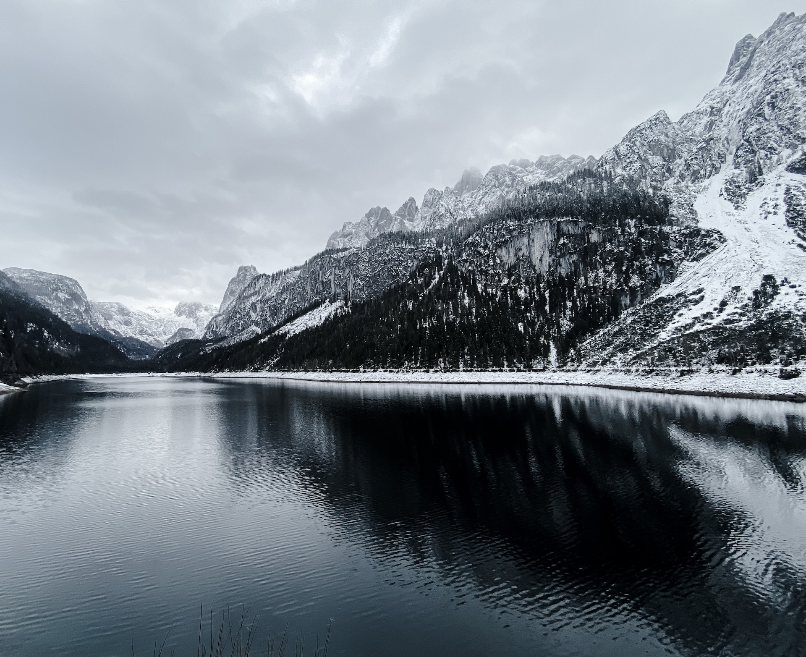
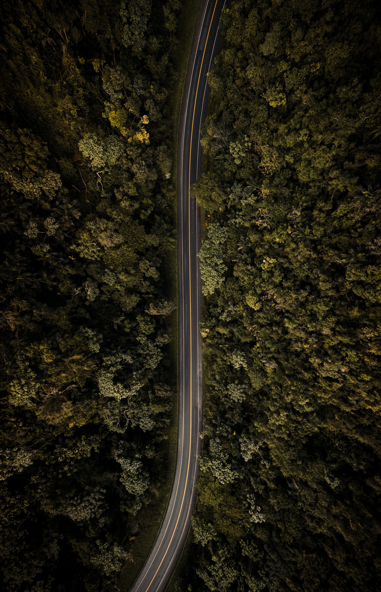

# dipc

[](https://crates.io/crates/dipc)

doprz' image palette converter

Convert your favorite images and wallpapers with your favorite color palettes/themes

## Color Palettes/Themes

- catppuccin
- dracula
- edge
- everforest
- gruvbox
- gruvbox-material
- nord
- onedark
- rose-pine
- solarized
- tokyo-night

## Examples

| Original | Converted |
| -------- | --------- |
|  |  |
|  |  |

### Image Credits

Victor Rosario - [https://unsplash.com/@vrrosario](https://unsplash.com/@vrrosario)

Ivan Rohovchenko - [https://unsplash.com/@ivrn](https://unsplash.com/@ivrn)

## Installation

### Cargo

```sh
cargo install dipc
```

### From Source

To build and install from source, first checkout the tag or branch you want to install, then run
```sh
cargo install --path .
```
This will build and install `dipc` in your `~/.cargo/bin`. Make sure that `~/.cargo/bin` is in your `$PATH` variable.

## Usage

```
Convert your favorite images and wallpapers with your favorite color palettes/themes

Usage: dipc [OPTIONS] <PALETTE> [FILE]...

Arguments:
  <PALETTE>
          The color palette to use:
              - name of a builtin theme
              - path to a theme in JSON
              - a JSON string with the theme (starting with `JSON: {}`)
          Run with --help instead of -h for a list of all builtin themes

          Builtin themes:
              - catppuccin
              - dracula
              - edge
              - everforest
              - gruvbox
              - gruvbox-material
              - nord
              - onedark
              - rose-pine
              - solarized
              - tokyo-night

  [FILE]...
          The image(s) to process

Options:
  -s, --styles <VARIATIONS>
          The color palette variation(s) to use
          Run with --help instead of -h for a list of all possible values

          Possible values:
              - `all` to generate an image for each of the variations
              - `none` if you are using a flat theme without variations
              - or a comma-delimited list of the names of variations it should use

          [default: all]

  -o, --output <PATH>
          Output image(s) name/path as a comma-delimited list

  -d, --dir-output <PATH>
          Output directory name/path

  -m, --method <METHOD>
          CIELAB DeltaE method to use

          [default: de2000]

          Possible values:
          - de2000:  The default DeltaE method
          - de1994g: CIE94 DeltaE implementation, weighted with a tolerance for graphics
          - de1994t: CIE94 DeltaE implementation, weighted with a tolerance for textiles
          - de1976:  The original DeltaE implementation, a basic euclidian distance formula

  -v, --verbose...
          Verbose mode (-v, -vv, -vvv)

  -h, --help
          Print help (see a summary with '-h')

  -V, --version
          Print version
```

## License

`dipc` is dual-licensed under the terms of both the MIT License and the Apache License 2.0

SPDX-License-Identifier: MIT OR Apache-2.0
